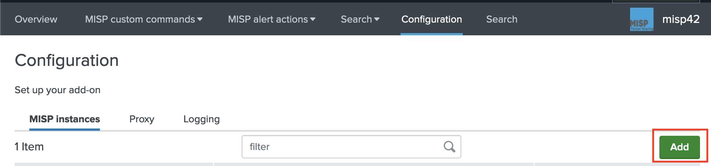

## Introduction
This TA alows interaction between your [Splunk](www.splunk.com) search head (cluster) and one or several [MISP](http://www.misp-project.org/) instance(s). It is a versatile TA that acts as a wrapper of MISP API to either collect MISP information into Splunk (custom commands) or push information from Splunk to MISP (alert actions).
The TA is designed to be easy to install, set up and maintain using the Splunk GUI.

## Usage  
1. MISP to SPLUNK (custom commands):  
 **`| mispgetioc misp_instance=default_misp _params_ | ...`** gets MISP event attributes into Splunk search pipeline.  
 **`| mispgetevent misp_instance=default_misp _params_ | ...`** gets MISP events into Splunk search pipeline using direct calls of the API.   
 **`search ... |mispsearch misp_instance=default_misp field=myvalue | ...`** searches for matching attributes in MISP.  
 **`search ... |mispsight  misp_instance=default_misp field=myvalue | ...`** gets sighting information for a specific value (note that if there is FP, only first hit is returned)
 ** IMPORTANT ** mispapireport has been replaced by mispgetioc (use json_request=)

2. MISP for SPLUNK: 2 Splunk alert actions are available          
 * one action to create new events or **edit** existing ones if you provide an eventid (or UUID). This allows to contribute to misp event(s) across several alert triggers.
 * one action to increment attribute sighting in a MISP instance.  

## Installation
This app is designed to run on **Splunk Search Head(s)** on Linux plateforms (not tested on Windows but it could work)  
1. **working with master** Download this [file](misp42splunk.tar.gz) which is the Splunk app
2. **working with other branches** Download the ZIP file and extract the folder misp42splunk which actually contains the Splunk app. You have to compress that folder as misp42splunk.tar.gz
3. Install the app on your Splunk Search Head(s): "Manage Apps" -> "Install app from file"
4. At next logon, you should be invited to configure the app (if not go to Manage Apps > misp42 > launch app)
5. create at least one instance for example "default_misp".
    - provide a name for example default_misp to follow the examples provided in this doc
    - provide the url to your MISP instance (version > 2.4.117)
    - provide the authkey,
    - check (or not) the certificate of the MISP server,
    - use (or not) the proxy for this instance,
    - provide client certificate if required (and check the box to use it)

6. If you need **several instances**, create additional entries.
7. Important: Role(s)/user(s) using this app must have the capability to "list_storage_passwords" (as API KEYs and proxy password(s) are safely stored encrypted).

## Use Cases
### Build a dashboard
You may get fresh attributes from a MISP instance and save them under an index (for example index=misp).
Then a dashboard can be build by using [this template](docs/dashboard_examples/misp_charts.xml). The result should be similar to [this video](https://www.youtube.com/watch?v=H2Z3gwJW7Fc&feature=youtu.be)
Thanks to @ran2 for sharing! 

### Hunting in Splunk logs
Fresh IOC from MISP > saved searches in Splunk 

### Creating (or editing) events based on automated sandboxing
If you have output of analysis pushed to Splunk you may automate the creation of events
Log on sandboxing output > saved search to qualify, sanitize (dedup remove top Alexa, etc.) and prepare the table (misp_*, fo_*, eo_* and no_*) > set a splunk alert to create event(s) in MISP
* Only fields prefixed with misp_ (or fo_ for file objects, eo_ for email objects, no_ for network objects) are imported
* Advise: for objects, verify the name of the fields to be created [Object definitions](https://github.com/MISP/misp-objects/tree/master/objects)
* If you provide an eventid, that event is updated with attributes and objects instead of creating a new one. **WARNING** apparently the **API does create duplicate objects** if you submit sevral time the same inputs.

### Sighting in MISP based on Splunk alerts
Search for attributes values/uuids in Splunk > alert to increment sighting counters (standard,false positive,expiration) in MISP for those values/uuids 

### Saved searches and Enterprise Security App
Several saved searches are provided to easily create KV store lookups which can be used later. The default behaviour is to append new event attributes to the KV store but you may switch to replace it.
Based on those searches, you can easily created local CSV files and feed intel to Enterprise Security App.  
you can also use this example (thanks @xg-simon for sharing):  

```conf
| mispgetioc misp_instance=default_misp pipesplit=true  add_description=true category="External analysis,Financial fraud,Internal reference,Network activity,Other,Payload delivery,Payload installation,Payload type,Persistence mechanism,Person,Social network,Support Tool,Targeting data" last=90d to_ids=true geteventtag=true warning_list=true not_tags="osint:source-type=\"block-or-filter-list\""
| eval ip=coalesce(misp_ip_dst, misp_ip_src,misp_ip)
| eval domain=misp_domain
| eval src_user=coalesce(misp_email_src, misp_email_src_display_name)
| eval subject=misp_email_subject
| eval file_name=misp_filename
| eval file_hash=coalesce(misp_sha1, misp_sha256, misp_sha512, misp_md5, misp_ssdeep)
| eval url=coalesce(misp_url,misp_hostname)
| eval http_user_agent=misp_user_agent
| eval registry_value_name=misp_regkey
| eval registry_value_text=if(isnotnull(misp_regkey),misp_value,null)
| eval description = misp_description
| table domain,description,file_hash,file_name,http_user_agent,ip,registry_value_name,registry_value_text,src_user,subject,url,weight
```

## Usage
- custom commands
    * [mispgetioc](docs/mispgetioc.md) reporting command leveraging /attributes/restSearch endpoint
    * [mispgetevent](docs/mispapireport.md) reporting command leveraging /events/restSearch endpoint
    * [mispsearch](docs/mispsearch.md) streaming command
    * [mispsight](docs/mispsight.md) streaming command
- Splunk alert actions to [update MISP](docs/mispalerts.md)
    *  Alert to create MISP event(s)
    *  Alert for attribute sighting in MISP.  
   
## Credits
The creation of this app started from work done by https://github.com/xme/splunk/tree/master/getmispioc and the associated blog https://blog.rootshell.be/2017/10/31/splunk-custom-search-command-searching-misp-iocs/ for MISP interactions.

## Licence
This app misp42splunk is licensed under the GNU Lesser General Public License v3.0.
