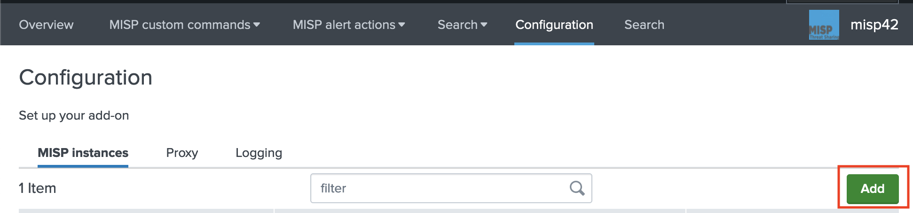

# MISP42 for Splunk

## Introduction

MISP42 is a Splunk add-on that enables bidirectional integration between [Splunk](https://www.splunk.com) and [MISP](https://www.misp-project.org/) (Malware Information Sharing Platform). It provides custom commands to pull threat intelligence from MISP into Splunk, and alert actions to push data from Splunk back to MISP.

## What's New in Version 6.0.0

- **Splunk Cloud Ready**: Fully compatible with Splunk Cloud environments (no filesystem access required)
- **Python 3.13 Support**: Updated for latest Python runtime
- **Improved `mispfetch` Command**: Versatile streaming command that can dynamically build MISP queries from SPL fields
- **Global Resource Limits**: Configure maximum response size and execution time to prevent runaway queries
- **Improved Sighting Support**: Enhanced sighting metrics with first/last timestamps and organisation tracking
- **Connection Timeouts**: Configurable connection and read timeouts per MISP instance
- **Field Prefix Configuration**: Customizable prefix for MISP fields per instance

## Requirements

- Splunk Enterprise 9.x or Splunk Cloud
- MISP 2.5.40 or higher
- Users must have `list_storage_passwords` capability

## Quick Start

1. **Install the add-on** from [Splunkbase](https://splunkbase.splunk.com/app/4335/) or upload the package manually
2. **Configure a MISP instance**:
   - Navigate to the app Configuration page
   - Add a new MISP instance with:
     - Instance name (e.g., `default_misp`)
     - MISP URL (must start with `https://`)
     - API key
     - Certificate verification setting
     - Optional: proxy settings, connection timeouts



3. **Configure Global Settings** (optional):
   - Max Response Size (MB): Limit cumulative response size (default: 100 MB, 0 = unlimited)
   - Max Execution Time (seconds): Limit query duration (default: 300s, 0 = unlimited)
   - Enable Limit Logging: Track pagination progress in logs
   - Progress Log Interval: How often to log progress (default: 10s)

## Custom Commands

### Generating Commands

These commands are used at the beginning of a search to pull data from MISP:

| Command | Description | Endpoint |
|---------|-------------|----------|
| `mispgetioc` | Retrieve attributes from MISP | `/attributes/restSearch` |
| `mispgetevent` | Retrieve events from MISP | `/events/restSearch` |
| `misprest` | Generic wrapper for any MISP REST API endpoint | Any endpoint |

**Example:**
```spl
| mispgetioc misp_instance=default_misp last=7d to_ids=true
```

### Streaming Commands

These commands enrich existing search results with MISP data:

| Command | Description |
|---------|-------------|
| `mispfetch` | Pull events or attributes and append to current dataset |
| `mispsearch` | Search MISP for matching attribute values |
| `mispgetattribute` | Get details for a specific attribute |

**Example with `mispfetch`:**
```spl
| makeresults
| eval misp_instance="default_misp", last="1d", published=true
| tojson last, published output_field=misp_http_body
| mispfetch getioc=true limit=100
```

### mispfetch vs mispgetioc/mispgetevent

- `mispfetch` is a **streaming** command - it appends MISP data to existing results
- Parameters can be set dynamically using SPL fields before calling the command
- `mispgetioc` and `mispgetevent` are **generating** commands - they must be first in the search

## Alert Actions

Two alert actions enable pushing data from Splunk to MISP:

### Create/Update MISP Event

Create new events or update existing ones based on search results:

- Fields prefixed with `misp_` become attributes
- Fields prefixed with `fo_` create file objects
- Fields prefixed with `eo_` create email objects  
- Fields prefixed with `no_` create domain-ip objects
- Provide an event ID/UUID to update existing events
- Optional: publish events automatically after creation/modification

**Inline field overrides:**
- `misp_info`: Set event info per row
- `misp_date`: Set event date (EPOCH timestamp)
- `misp_tag`: Add tags (comma-separated)
- `misp_publish_event`: Set to `1` to publish (overrides alert config)
- `misp_sg_id`: Sharing group ID (when distribution=4)

### Sighting Alert

Increment sighting counters for attributes in MISP:

- Sighting by value or by attribute UUID
- Sighting types: 0 (standard), 1 (false positive), 2 (expiration)
- Optional source field for tracking

## Use Cases

### Threat Intelligence Dashboard

Pull IOCs from MISP and index them for dashboards:

```spl
| mispgetioc misp_instance=default_misp last=30d to_ids=true category="Network activity"
| eval ip=coalesce(misp_ip_dst, misp_ip_src)
| table ip, misp_type, misp_event_info, misp_tag
```

### Hunting with MISP Intel

Enrich your logs with threat intelligence:

```spl
index=firewall sourcetype=palo_traffic
| lookup misp_ioc_lookup value as dest_ip OUTPUT misp_event_info, misp_threat_level
| where isnotnull(misp_event_info)
```

### Automated Event Creation

Push sandbox results or alerts to MISP:

```spl
index=sandbox sourcetype=analysis_results
| eval misp_ip_dst=dest_ip, misp_domain=domain, misp_md5=file_hash
| table misp_*
```
Then configure the "MISP Create Event" alert action.

### Recording Sightings

Track when IOCs are seen in your environment:

```spl
index=proxy 
| lookup misp_ioc_lookup value as url OUTPUT misp_attribute_uuid
| where isnotnull(misp_attribute_uuid)
| table misp_attribute_uuid, _time
```
Then configure the "MISP Sighting" alert action.

## Documentation

Detailed documentation for each command:

- [mispfetch](docs/mispfetch.md) - Streaming command for flexible MISP queries
- [mispgetioc](docs/mispgetioc.md) - Generating command for attributes
- [mispgetevent](docs/mispgetevent.md) - Generating command for events
- [misprest](docs/misprest.md) - Generic MISP REST API wrapper
- [mispsearch](docs/mispsearch.md) - Streaming command for attribute search
- [mispgetattribute](docs/mispgetattribute.md) - Get single attribute details
- [Alert Actions](docs/mispalerts.md) - Create events and record sightings

## Extending with Custom Datatypes

Add custom field-to-MISP-type mappings by editing `lookups/misp_datatypes.csv`:

```csv
field_name,field_type,datatype
src_ip,attribute,ip-src
dest_ip,attribute,ip-dst
file_hash,attribute,md5
```

This enables Enterprise Security Adaptive Response compatibility.

## Troubleshooting

- **Logs**: Check `$SPLUNK_HOME/var/log/splunk/misp42splunk.log`
- **Connection issues**: Verify MISP URL starts with `https://` and API key is valid
- **Permission errors**: Ensure user has `list_storage_passwords` capability
- **Timeouts**: Adjust connection/read timeouts in instance configuration
- **Large queries**: Configure global limits to prevent excessive resource usage

## Credits

This app evolved from work by [@xme](https://github.com/xme/splunk/tree/master/getmispioc) and the associated [blog post](https://blog.rootshell.be/2017/10/31/splunk-custom-search-command-searching-misp-iocs/).

## License

This app is licensed under the [GNU Lesser General Public License v3.0](https://www.gnu.org/licenses/lgpl-3.0.txt).

## Author

Remi Seguy ([@remg427](https://github.com/remg427))
