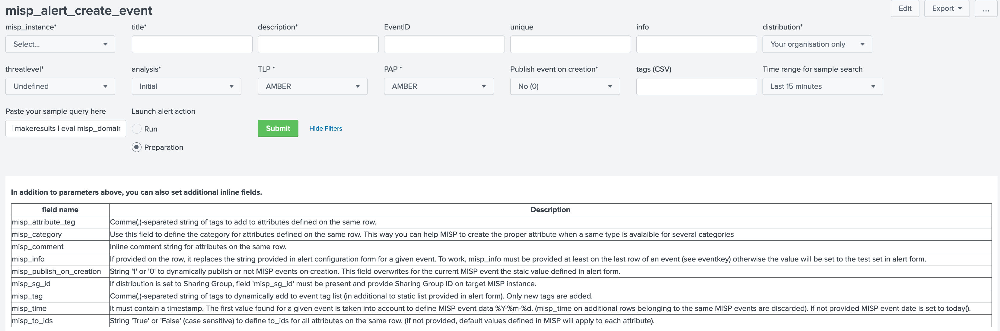

# Alerts to interact with MISP
## Create MISP event(s)    
When you create an alert, you may add an alert action to directly create events (or edit events) in MISP based on search results.
This version of the app requires MISP 2.4.97 or later.
You may also send alerts from the search pipeline |sendalert
 for example for an alert action 

### collect results in Splunk
You may search and prepare the results as a table with the following command
```
| rename field1 AS misp_attribute_name (prefix misp_ is removed & '_' are replaced by '-' )
| rename field2 AS fo_object_attribute_name (for file objects)
| rename field3 AS eo_object_attribute_name (for email objects)
| rename field4 AS no_object_attribute_name (for network connection objects)
| eval misp_time=round(_time,0) | eval misp_info=<some string> |eval misp_tag=<some (CSV) string>  
| table eventkey misp_time misp_info misp_tag to_ids misp_category misp_* fo_* eo_* no_* (etc.)
```
CAUTION: Splunk syntax does not like field names containing '-'.  
Do not forget to check the [object attribute names](https://github.com/MISP/misp-objects/). To use objects, you need to use an object prefix (fo_, no_, eo_) followed by the object attribute name as splunk field name.  
For example eo_from for the sender address in an email object.

* Optional fields:
    - misp_time: the timestamp will be converted to YYYY-MM-DD for event date. if not provided, it is set to localtime. for example | eval misp_time = round(_time,0)
    - to_ids: if not defined, set to False
    - misp_category: if not defined, set to None and populated in relation with the type of attribute
    - eventkey: This string/id is used to group several rows of the results belonging to the same event (e.g. attributes of type email-src, email-subject). The actual value is not pushed to MISP. If not specified by row, this value might be overall defined for the alert - see below
    - misp_info: This string will be set in the Info field of MISP event. This value might be overall defined for the alert - see below
    - misp_tag: a CSV string of additional event tags (some can be set in the alert action form)


### create the alert and add alert_action to create events (form)
Save your search as alert. Select "Alert to create MISP event(s)" as action
Fill in the form to tune your alert to your needs.

* Alert overall description: this section is for Splunk documentation
    - **title**: The title of this alert.
    - Description: The description to send with the alert.
    - **misp_instance**: the misp instance name as defined in misp42splunk_instances.conf
* Global event parameters: the parameters will apply for all events created by this alert unless overwritten (see above)
    - eventid: the event you want to add attrributes and objects. Leave blank or put 0 to create new events (default)
    - unique: indicate the field containing the unique id to group several rows under a single event. If not defined an default eventkey will be generated and all results will be added to the same event.
    - info: This string will be set in the Info field of MISP event. If not defined, the Info field will contain 'malspam'. By default, it takes a copy of the description (token $description$)
    - **distribution**: Change the Distribution. Defaults to Your organisation only
            <option value="0">Your organisation only</option>    
            <option value="1">This community only</option>
            <option value="2">Connected communities</option>
            <option value="3">All communities</option>
            <option value="4">Sharing Group</option>
    - **threatlevel**: Change the Threat Level. Defaults to Undefined
            <option value="1">High</option>
            <option value="2">Medium</option>
            <option value="3">Low</option>
            <option value="4">Undefined</option>
    - **analysis**: Change Analysis status. Default to Initial
            <option value="1">Initial</option>
            <option value="2">Ongoing</option>
            <option value="3">Complete</option>
    - **tlp**: WHITE-GREEN-AMBER-RED Change the TLP of the created alert. Defaults to TLP-Amber
    - **pap**: WHITE-GREEN-AMBER-RED Permissible Action Protocol
    - tags: comma-separated list of tags

### example to create events (sendalert)
  .... | table mips_ip fo_filename, fo_md5, fo_sha256 |sendalert misp_alert_create_event param.title="my alert" param.misp_instance=default_misp param.distribution=3 param.threatlevel=3 param.analysis=1 param.tlp="TLP_GREEN" param.pap="TLP_AMBER"

### logging
logs are in /opt/splunk/var/log/splunk/misp_alert_create_event_modalert.log

## Alert for sighting

### search results with one field for timestamp (recommended)
Build your search with as many fields as you want. One field should contain a valid timestamp.

### create the alert and add alert_action for sighting
Save your search as alert. Select "Alert for sighting MISP attribute(s)" as action
Fill in the form to tune your alert to your needs.

IMPORTANT: for mode **byuuid** , only first uuid is kept. If the field is a multivalue field other entries are lost. If needed you may prepare uuid list in Splunk using mvdedup and mvexpand commands.

* Global event parameters: the parameters will apply for all events created by this alert unless overwritten (see above)
    - **title**: title of the alert
    - description: description
    - **misp_instance**: the misp instance name as defined in misp42splunk_instances.conf
    - unique: indicate the field containing timestamps. If not defined, defaults is now()
    - **mode**; indicate if sighting is by __value__ or __by attribute uuid__
    - **type**; indicate if sighting type is
        * Sighting type 0, the default sighting type using the default STIX interpretation of a sighting.
        * Sighting type 1, a false-positive sighting which means this sighting has been interpreted as a false-positive by the organisation.
        * Sighting type 2, an expiration sighting which defines when the sighted attributes is to be expired.

### example to create events (sendalert)
...|table ip |sendalert misp_alert_sighting param.title="my sighting alert" param.misp_instance=default_misp param.mode=byvalue param.type=0

### logging
logs are in /opt/splunk/var/log/splunk/misp_alert_sighting_modalert.log

