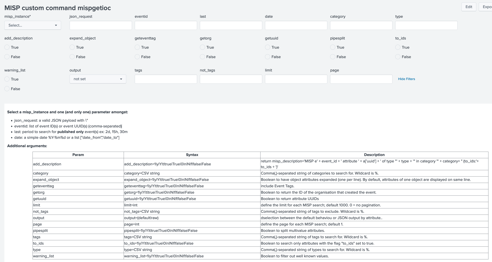

# mispgetioc
## custom command mispgetioc version 3.1
This custom command must be the first of a search (or a sub-search). The results are displayed in a table that contains:

- always following fields = ['misp_attribute_id', 'misp_category', 'misp_event_id', 'misp_event_uuid', 'misp_object_id', 'misp_timestamp', 'misp_to_ids', 'event_tag', 'misp_tag', 'misp_type', 'misp_value'  ]
- if object_id is not equal 0, object attributes are displayed on the same row and field type is set to object, value to object_id
- depending on options, 'misp_attribute_uuid' (getuuid is True), 'misp_orgc_id' (getorg is True), 'misp_event_info' and 'misp_description' (add_descriptioon is True)
- and a column by type either with a value or empty

So the output can be immediately reused in a search without complex transforms

The command syntax is as follow:

    |mispgetioc **[misp_instance=instance_name] ( [json_request=@JSON] [eventid=(uu)id] or string (comma-separated)| [last=interval]  | [date="YYYY-mm-dd"] )**
            add_description = boolean
            category = string (comma-separated)
            expand_object = boolean
            geteventtag = boolean
            getorg = boolean
            getuuid = boolean
            include_deleted = boolean
            limit = integer
            not_tags = string (comma-separated)
            output = (default|raw)
            pipesplit = boolean
            tags = string (comma-separated)
            to_ids = boolean
            type = string (comma-separated)
            warning_list = boolean
        
----
    Note: Boolean can be <1|y|Y|t|true|True|0|n|N|f|false|False>
----
- **In version >= 3.0.0, you musp provide misp_instance name**
- You must set either parameter 'json_request' 'eventid', 'last' or 'date'
    + eventid is either a single value (event_id on the instance, uuid) or a comma-separated list of values. You can mix event_ids and event uuids.
    + last interval is a number followed by a letter d(ays), h(ours) or m(inutes)
    + date is any valid time filter

## examples
see also for example for a generating command (first line of SPL)
 

one example:

    |mispgetioc misp_instance=default_misp eventid=477 category="Payload delivery,Network activity,External analysis" type="sha256,domain,ip-dst,text" getuuid=Y getorg=Y

will return the following columns

    | _time | misp_category | misp_event_id | misp_ip_dst | misp_domain | misp_sha256 | misp_orgc | misp_text | misp_to_ids | misp_type | misp_attribute_uuid | misp_value

another example:

    |mispgetioc misp_instance=default_misp last=7d type="sha256,domain,ip-dst,text" to_ids=Y getuuid=Y getorg=Y

- The other parameters are optional
    + you may filter the results using
        - to_ids (boolean),
        - [type](https://www.circl.lu/doc/misp/categories-and-types/#types). Use a CSV string to list the types; for example type="domain" or type="domain,hostname,ip-dst"
        - [category](https://www.circl.lu/doc/misp/categories-and-types/#categories) Use a CSV string to list the categories; for example category="Payload delivery" or category="Payload delivery,Network activity,External analysis"
        - tags. Use a CSV string to search for events with these tags
        - not_tags. Use a CSV string to search for events which have not these tags

    + you may set getuuid=Y to get the event UUID in the results 
    + likewise set getorg=Y to list the originating organisation
    + geteventtag will return event tags in the result
    + **if you want to split multivalue attributes set pipesplit to "True" **

## All params

    misp_instance = Option(
        doc='''
        **Syntax:** **misp_instance=instance_name*
        **Description:** MISP instance parameters
        as described in local/misp42splunk_instances.conf.''',
        require=True)
    # MANDATORY: json_request XOR eventid XOR last XOR date
    json_request = Option(
        doc='''
        **Syntax:** **json_request=***valid JSON request*
        **Description:**Valid JSON request''',
        require=False)
    eventid = Option(
        doc='''
        **Syntax:** **eventid=***id1(,id2,...)*
        **Description:**list of event ID(s) or event UUID(s).''',
        require=False, validate=validators.Match("eventid", r"^[0-9a-f,\-]+$"))
    last = Option(
        doc='''
        **Syntax:** **last=***<int>d|h|m*
        **Description:** publication duration in day(s), hour(s) or minute(s).
        **nota bene:** last is an alias of published_timestamp''',
        require=False, validate=validators.Match("last", r"^[0-9]+[hdm]$"))
    date = Option(
        doc='''
        **Syntax:** **date=***The user set event date field
         - any of valid time related filters"*
        **Description:**starting date.
         **eventid**, **last** and **date** are mutually exclusive''',
        require=False)
    # Other params
    add_description = Option(
        doc='''
        **Syntax:** **add_description=***<1|y|Y|t|true|True
        |0|n|N|f|false|False>*
        **Description:**Boolean to return misp_description.''',
        require=False, validate=validators.Boolean())
    category = Option(
        doc='''
        **Syntax:** **category=***CSV string*
        **Description:**Comma(,)-separated string of categories to search for.
         Wildcard is %.''',
        require=False)
    expand_object = Option(
        doc='''
        **Syntax:** **gexpand_object=***<1|y|Y|t|true|True|0|n|N|f|false|False>*
        **Description:**Boolean to have object attributes expanded (one per line).
        By default, attributes of one object are displayed on same line.''',
        require=False, validate=validators.Boolean())
    geteventtag = Option(
        doc='''
        **Syntax:** **geteventtag=***<1|y|Y|t|true|True|0|n|N|f|false|False>*
        **Description:**Boolean includeEventTags. By default only
         attribute tag(s) are returned.''',
        require=False, validate=validators.Boolean())
    getorg = Option(
        doc='''
        **Syntax:** **getorg=***<1|y|Y|t|true|True|0|n|N|f|false|False>*
        **Description:**Boolean to return the ID of the organisation that
         created the event.''',
        require=False, validate=validators.Boolean())
    getuuid = Option(
        doc='''
        **Syntax:** **getuuid=***<1|y|Y|t|true|True|0|n|N|f|false|False>*
        **Description:**Boolean to return attribute UUID.''',
        require=False, validate=validators.Boolean())
    include_deleted = Option(
        doc='''
        **Syntax:** **include_deleted=***<1|y|Y|t|true|True|0|n|N|f|false|False>*
        **Description:**Boolean include_deleted. By default only not-deleted
        attribute are returned.''',
        require=False, validate=validators.Boolean())
    limit = Option(
        doc='''
        **Syntax:** **limit=***<int>*
        **Description:**define the limit for each MISP search;
         default 1000. 0 = no pagination.''',
        require=False, validate=validators.Match("limit", r"^[0-9]+$"))
    not_tags = Option(
        doc='''
        **Syntax:** **not_tags=***CSV string*
        **Description:**Comma(,)-separated string of tags to exclude.
         Wildcard is %.''',
        require=False)
    output = Option(
        doc='''
        **Syntax:** **output=***<default|rawy>*
        **Description:**selection between the default behaviou or JSON output by attribute.''',
        require=False, validate=validators.Match(
            "output", r"(default|raw)"))
    page = Option(
        doc='''
        **Syntax:** **page=***<int>*
        **Description:**define the page for each MISP search; default 1.''',
        require=False, validate=validators.Match("limit", r"^[0-9]+$"))
    pipesplit = Option(
        doc='''
        **Syntax:** **pipesplit=***<1|y|Y|t|true|True|0|n|N|f|false|False>*
        **Description:**Boolean to split multivalue attributes.''',
        require=False, validate=validators.Boolean())
    tags = Option(
        doc='''
        **Syntax:** **tags=***CSV string*
        **Description:**Comma(,)-separated string of tags to search for.
         Wildcard is %.''',
        require=False)
    to_ids = Option(
        doc='''
        **Syntax:** **to_ids=***<1|y|Y|t|true|True|0|n|N|f|false|False>*
        **Description:**Boolean to search only attributes with the flag
         "to_ids" set to true.''',
        require=False, validate=validators.Boolean())
    type = Option(
        doc='''
        **Syntax:** **type=***CSV string*
        **Description:**Comma(,)-separated string of types to search for.
         Wildcard is %.''',
        require=False)
    warning_list = Option(
        doc='''
        **Syntax:** **warning_list=***<1|y|Y|t|true|True|0|n|N|f|false|False>*
        **Description:**Boolean to filter out well known values.''',
        require=False, validate=validators.Boolean())

## logging
in the app, you can set the logging level. logs are written to misp42.log (access via inspect jobs).
