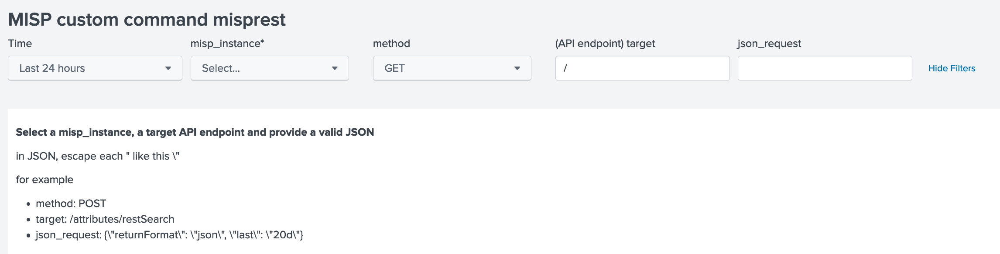

# custom command misprest

This custom command is a wrapper to call MISP API endpoints

## [misprest-command]
syntax = |misprest <misprest-options> 
shortdesc = MISP REST API wrapper: provide misp_instance, method, target and a valid JSON request. (don't forget to escape " like this \")
usage = public
example1 = | misprest misp_instance=test method=POST target="/attributes/restSearch" json_request="{\"returnFormat\": \"json\", \"last\": \"20d\"}"
comment1 = retrieve attributes of all events published in last 20 days and display as events
example:

 
    
# All params
## MANDATORY MISP instance for this search
    misp_instance = Option(
        doc='''
        **Syntax:** **misp_instance=instance_name*
        **Description:** MISP instance parameters
        as described in local/misp42splunk_instances.conf.''',
        require=True)
    method = Option(
        doc='''
        **Syntax:** **method=****
        **Description:** method to use for API target DELETE GET PATCH POST PUT.''',
        require=True, validate=validators.Match("method", r"^(DELETE|GET|POST|PUT)$"))
    target = Option(
        doc='''
        **Syntax:** **target=api_target****
        **Description:**target of MISP API.''',
        require=True, validate=validators.Match("target", r"^/(?:[a-zA-Z]|[0-9]|[$-_@.&+]|[!*\(\),]|(?:%[0-9a-fA-F][0-9a-fA-F]))+$"))

## Other params
    json_request = Option(
        doc='''
        **Syntax:** **json_request=***JSON request*
        **Description:** JSON-formatted json_request.''',
        require=False, validate=validators.Match("json_request", r"^{.+}$"))
    limit = Option(
        doc='''
        **Syntax:** **limit=***<int>*
        **Description:**define the limit for each MISP search;
         default 1000. 0 = no pagination.''',
        require=False, validate=validators.Match("limit", r"^[0-9]+$"))
    page = Option(
        doc='''
        **Syntax:** **page=***<int>*
        **Description:**define the page for each MISP search; default 1.''',
        require=False, validate=validators.Match("page", r"^[0-9]+$"))

